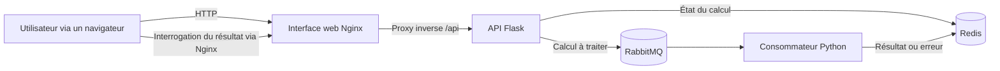

# Calculatrice cloud native

[](https://github.com/lele9627/calculatrice-cloud-native/actions/workflows/ci.yml)

## Présentation du projet

Calculatrice cloud native est une application web distribuée à vocation pédagogique créée par Léopold Saublet et Victor Olivier. Nginx sert l’interface dans le navigateur et transmet les requêtes API à Flask. L’API enregistre l’état des calculs dans Redis et publie les tâches dans RabbitMQ. Un consommateur Python asynchrone traite chaque expression et stocke le résultat dans Redis afin que l’interface web puisse l’interroger.

Le dépôt contient également des images Docker, des manifestes Kubernetes et un socle Terraform distinct pour Scaleway. Cette documentation décrit l’implémentation dans son état actuel ; elle ne remanie ni l’application, ni les ressources Kubernetes, ni l’infrastructure cloud.

## Fonctionnalités principales

- Interface dans le navigateur pour effectuer des calculs arithmétiques.
- Soumission asynchrone des tâches avec RabbitMQ.
- États `queued`, `processing`, terminé et en échec stockés temporairement dans Redis.
- Point de terminaison interrogé pour récupérer les résultats.
- Points de terminaison Flask de contrôle d’état pour Redis et RabbitMQ.
- Images distinctes pour l’interface web, l’API et le consommateur.
- Manifestes Kubernetes pour les cinq composants de l’application.
- Exercice Terraform comprenant un registre Scaleway, un cluster Kubernetes, des bases de données, des adresses de répartiteur de charge et des enregistrements DNS.
- Environnement Docker Compose à cinq services ajouté pour l’évaluation locale sans modifier le code de l’application.

## Architecture



Le traitement d’une requête suit ces étapes :

1. Le navigateur envoie une expression à `POST /api/calc`.
2. Flask attribue un identifiant à l’opération, stocke l’état `queued` dans Redis et publie un message durable dans RabbitMQ.
3. Le consommateur marque l’opération comme `processing`, évalue l’expression et stocke soit un résultat, soit une erreur.
4. Le navigateur interroge `GET /api/result/<id>` jusqu’à la fin de l’opération.
5. Redis supprime les données de l’opération après 600 secondes.

## Technologies utilisées

| Domaine | Technologie | Rôle actuel |
| --- | --- | --- |
| Interface web | HTML, CSS, JavaScript, Nginx | Interface de la calculatrice et proxy inverse `/api` |
| API | Python, Flask | Création des tâches, récupération des résultats et contrôle d’état des dépendances |
| Messagerie | RabbitMQ, Pika | File de tâches asynchrones durables |
| État | Redis | États temporaires des opérations, résultats et erreurs |
| Conteneurs | Docker, Docker Compose | Images des composants et orchestration locale |
| Orchestration | Kubernetes, Nginx Ingress | Déploiement pédagogique sur un cluster |
| Infrastructure en tant que code | Terraform, fournisseur Scaleway | Exercice distinct de socle cloud |
| Automatisation | GitHub Actions | Syntaxe, tests, contrôle des manifestes, validation Terraform et construction des images |

## Structure du dépôt

```text
.
├── .github/workflows/ci.yml   # Contrôles des pull requests et de la branche principale
├── application/               # Composants, Dockerfiles et règles d’exclusion de construction existants
├── foundation/                # Configuration Terraform Scaleway existante
├── kubernetes/                # Manifestes Kubernetes existants
├── tds/                       # Exercices et notes de cours antérieurs
├── tests/                     # Tests non intrusifs du comportement Python actuel
├── .env.example               # Modèle des ports et de la file pour Compose en local
├── CONTRIBUTING.md            # Consignes de contribution et de validation
└── docker-compose.yml         # Environnement local à cinq services
```

## Prérequis

Pour l’environnement local complet :

- Docker Engine ou Docker Desktop avec Docker Compose v2 ;
- un navigateur ou `curl` pour les vérifications.

Pour le développement et les contrôles d’infrastructure :

- Python 3.10 ou une version ultérieure ;
- Terraform ;
- `kubectl` et un accès à un cluster Kubernetes adapté ;
- `kubeconform` pour valider les manifestes en local.

La planification ou le déploiement dans le cloud nécessite également un compte Scaleway autorisé. Ne commitez jamais d’identifiants cloud, de fichiers d’état, de kubeconfigs ou de fichiers d’environnement.

## Installation locale

Le parcours de développement recommandé conserve les sources Python existantes et démarre uniquement Redis et RabbitMQ avec Compose :

```bash
cp .env.example .env
docker compose up -d redis rabbitmq

python3 -m venv .venv
. .venv/bin/activate
python -m pip install -r application/requirements.txt

export REDIS_HOST=127.0.0.1
export REDIS_PORT=6379
export RABBIT_HOST=127.0.0.1
export RABBIT_PORT=5672
export RABBIT_QUEUE=calc_jobs
python application/app.py
```

Dans un second terminal, activez le même environnement virtuel, exportez les mêmes variables, puis exécutez :

```bash
python application/consumer.py
```

L’API écoute alors sur `http://localhost:5000`. Ce mode de développement direct ne sert pas l’interface web Nginx.

## Utilisation de Docker

Créez le fichier facultatif de paramètres locaux et inspectez la configuration résolue :

```bash
cp .env.example .env
docker compose config
```

Démarrez les cinq services :

```bash
docker compose up --build -d
docker compose ps
```

Ouvrez `http://localhost:8080`, sauf si `FRONTEND_PORT` a été modifié. Par défaut, l’interface d’administration de RabbitMQ est liée à l’interface locale sur `http://localhost:15672`.

Vérifiez les points de terminaison de contrôle d’état des dépendances via Nginx :

```bash
curl --fail http://localhost:8080/api/health/redis
curl --fail http://localhost:8080/api/health/rabbit
```

N’envoyez un calcul que dans un environnement local de confiance :

```bash
curl --fail \
  --header 'Content-Type: application/json' \
  --data '{"expression":"12*(3+4)"}' \
  http://localhost:8080/api/calc
```

Utilisez l’identifiant renvoyé avec `GET /api/result/<id>`. Inspectez ou arrêtez l’environnement avec :

```bash
docker compose logs --tail=100 backend consumer
docker compose down
```

Les clients Python inchangés utilisent les valeurs par défaut `guest/guest` de Pika. Pour assurer la compatibilité, le fichier Compose autorise ce compte sur son réseau en pont local isolé. Tous les ports publiés sont liés à `127.0.0.1`, mais cette configuration reste strictement réservée au développement local et ne doit pas être réutilisée dans un environnement partagé ou de production.

Les Dockerfiles d’origine continuent d’utiliser `application/` comme contexte de construction :

```bash
docker build -t calculator-backend -f application/Dockerfile.backend application
docker build -t calculator-consumer -f application/Dockerfile.consumer application
docker build -t calculator-frontend -f application/Dockerfile.frontend application
```

## Déploiement Kubernetes

Les manifestes existants décrivent les ressources de l’interface web, de l’API, du consommateur, de Redis et de RabbitMQ dans l’espace de noms `victor-leopold`. Ils référencent des images applicatives externes fixes et un nom d’hôte Ingress pédagogique.

Contrôlez-les et validez-les avant d’utiliser un cluster :

```bash
kubeconform -strict -summary kubernetes/
kubectl diff -f kubernetes/
```

La procédure de déploiement d’origine est documentée dans [`kubernetes/README.md`](kubernetes/README.md). Aucune ressource Kubernetes n’a été remaniée dans le cadre de ce travail de portfolio.

Limite actuelle importante : les manifestes configurent RabbitMQ avec le compte intégré `guest`, tandis que l’API et le consommateur se connectent depuis des pods distincts. RabbitMQ limite normalement ce compte aux connexions en boucle locale ; le fonctionnement Kubernetes de bout en bout doit donc être validé à nouveau avant tout déploiement. La correction de l’authentification modifierait la configuration d’exécution et est volontairement réservée à une évolution technique distincte, soumise à une revue explicite.

## Infrastructure Terraform

[`foundation/main.tf`](foundation/main.tf) est l’exercice Scaleway autonome existant. Il déclare :

- un espace de noms Container Registry ;
- un cluster Kapsule utilisant Cilium ;
- des instances PostgreSQL de développement et de production ;
- deux adresses IP de répartiteur de charge ;
- des enregistrements DNS de développement et de production.

La configuration Terraform ne déploie pas la calculatrice et ne relie pas ces ressources aux manifestes Kubernetes. Validez-la sans appliquer l’infrastructure :

```bash
terraform -chdir=foundation fmt -check
terraform -chdir=foundation init -backend=false
terraform -chdir=foundation validate
```

La planification ou l’application nécessite des identifiants Scaleway autorisés et peut créer des ressources facturables. Consultez [`foundation/README.md`](foundation/README.md) et examinez le plan avant toute action cloud. Aucune ressource Terraform n’a été modifiée dans cette branche de portfolio.

## Variables de configuration

L’application Python existante lit les variables suivantes :

| Variable | Valeur par défaut de l’API | Valeur par défaut du consommateur | Rôle |
| --- | --- | --- | --- |
| `REDIS_HOST` | `redis-service` | `localhost` | Nom d’hôte Redis |
| `REDIS_PORT` | `6379` | `6379` | Port Redis |
| `RABBIT_HOST` | `rabbitmq-service` | `localhost` | Nom d’hôte RabbitMQ |
| `RABBIT_PORT` | `5672` | `5672` | Port AMQP de RabbitMQ |
| `RABBIT_QUEUE` | `calc_jobs` | `calc_jobs` | Nom de la file |

Le TTL Redis de 600 secondes et les identifiants RabbitMQ par défaut de Pika sont actuellement définis directement dans le code.

Docker Compose lit également :

| Variable | Valeur par défaut | Rôle |
| --- | --- | --- |
| `FRONTEND_PORT` | `8080` | Port Nginx local |
| `REDIS_PUBLISHED_PORT` | `6379` | Port Redis local |
| `RABBIT_PUBLISHED_PORT` | `5672` | Port AMQP local |
| `RABBIT_MANAGEMENT_PORT` | `15672` | Port local d’administration de RabbitMQ |
| `RABBIT_QUEUE` | `calc_jobs` | File transmise à l’API et au consommateur |

Copiez `.env.example` vers `.env` et conservez `.env` hors du suivi Git.

## Tests

Installez les dépendances existantes de l’application, puis exécutez les contrôles de syntaxe et les tests qui observent le comportement actuel de l’API et du consommateur :

```bash
python -m compileall -q application tests
python -m unittest discover -s tests -v
```

Exécutez les contrôles de configuration lorsque les outils correspondants sont disponibles :

```bash
docker compose config --quiet
docker compose build
kubeconform -strict -summary kubernetes/
terraform -chdir=foundation fmt -check
terraform -chdir=foundation init -backend=false
terraform -chdir=foundation validate
```

Le processus CI proposé s’exécute sur les pull requests et les envois vers `main`. Il installe les dépendances, effectue les contrôles Python, valide les configurations Kubernetes et Terraform, puis construit les trois images. Il ne publie aucune image, n’applique pas Terraform et ne déploie rien dans Kubernetes.

## Résolution des problèmes

### Docker Compose est indisponible

Vérifiez que l’extension Compose v2 est installée :

```bash
docker compose version
```

Docker doit également être démarré pour que `docker compose up` ou la construction des images puisse réussir.

### Un service reste en mauvais état

```bash
docker compose ps
docker compose logs --tail=100 redis rabbitmq backend
```

RabbitMQ peut nécessiter plus de temps que Redis pour s’initialiser. Le contrôle d’état de l’API attend que les deux dépendances soient disponibles.

### Un calcul reste dans la file

Vérifiez que le consommateur est en cours d’exécution et connecté à la même file :

```bash
docker compose logs --tail=100 consumer rabbitmq
```

### Un résultat devient inconnu

Les données de l’opération sont supprimées de Redis après 600 secondes. Envoyez à nouveau le calcul.

### Un port de l’hôte est déjà utilisé

Modifiez le port publié correspondant dans `.env`, puis recréez l’environnement. Les ports internes doivent rester inchangés.

## Limites connues

- Le consommateur évalue les expressions avec la fonction Python `eval` en supprimant uniquement les fonctions intégrées ; ce mécanisme ne constitue pas un environnement isolé robuste. N’exposez pas l’API actuelle à des entrées non fiables ou à un réseau public.
- L’API ne dispose d’aucune authentification, autorisation, limitation de débit ou terminaison TLS.
- Certains types de champs JSON incorrects peuvent produire une erreur interne au lieu d’une réponse `400` contrôlée.
- Le texte des exceptions des dépendances peut être stocké et renvoyé au client, ce qui risque de divulguer des détails d’implémentation.
- Le serveur de développement Flask est utilisé directement à la place d’un serveur WSGI de production.
- Les clients Python actuels utilisent `guest/guest` pour RabbitMQ ; le réglage de compatibilité de Compose ne convient pas en dehors d’une machine de développement isolée.
- Redis et RabbitMQ utilisent chacun une seule instance éphémère.
- Les manifestes Kubernetes utilisent des images externes fixes et leur fonctionnement de bout en bout n’a pas été démontré pendant cette revue.
- La plupart des charges de travail Kubernetes ne définissent ni sondes, ni politiques de ressources, ni persistance, ni haute disponibilité. L’API et l’interface web utilisent directement des ReplicaSets plutôt que des Deployments.
- Terraform constitue un exercice distinct qui n’est pas relié à l’application. Son cluster ne contient aucune ressource de groupe de nœuds, la version du fournisseur Scaleway n’est pas contrainte et les versions fixes de la plateforme sont suffisamment anciennes pour nécessiter une vérification de leur disponibilité avant toute réutilisation.
- Les tests couvrent une sélection de parcours actuels de l’API et du consommateur ; il n’existe aucun test d’intégration pour le navigateur, Compose, Kubernetes ou le cloud.

## Améliorations futures

Les éléments suivants sont uniquement des propositions et nécessiteraient une revue de conception distincte avant toute implémentation :

- remplacer l’évaluation des expressions par un analyseur arithmétique dédié ;
- ajouter une validation et des réponses d’erreur contrôlées sans modifier le contrat de l’API publique ;
- introduire des identifiants RabbitMQ différents de ceux par défaut à l’aide d’une gestion des secrets validée ;
- exécuter Flask derrière un serveur WSGI de production ;
- ajouter une authentification, une limitation de débit, TLS et une observabilité structurée ;
- ajouter des tests de bout en bout pour le traitement asynchrone ;
- revoir les contrôleurs des charges de travail Kubernetes, les sondes, les ressources, la persistance et la livraison des images ;
- aligner le socle Terraform sur la plateforme applicative visée.

## Contributeurs

- [Léopold Saublet](https://github.com/lele9627)
- [Victor Olivier](https://github.com/Victor3699)

Consultez [`CONTRIBUTING.md`](CONTRIBUTING.md) pour connaître le processus de revue proposé.

## Licence

Aucun fichier de licence n’est inclus. Le dépôt compte deux contributeurs documentés et aucun élément existant ne permet d’établir que l’un d’eux peut, à lui seul, placer l’ensemble du travail sous licence. La réutilisation n’est donc pas autorisée par défaut. Ajoutez une licence uniquement après accord des deux contributeurs sur ses conditions.
