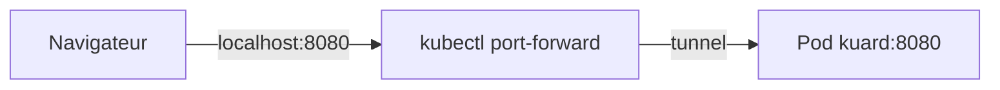
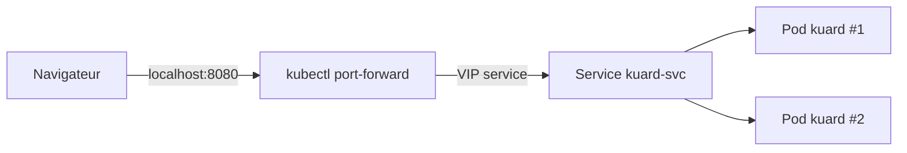

# TD Kubernetes

Ce dossier contient les manifests et les réponses attendues.

## 1) Pod simple

Fichier : `tds/kubernetes/manifests/pod.yaml`

Commandes :
```bash
kubectl apply -f tds/kubernetes/manifests/pod.yaml
kubectl get pod -n victor-leopold
```

### Accès au pod
```bash
kubectl port-forward pod/kuard-pod -n victor-leopold 8080:8080
```
Accès : `http://localhost:8080`

### Schéma (port-forward)


## 2) ReplicaSet

Fichier : `tds/kubernetes/manifests/replicaset.yaml`

Observation attendue après suppression d'un pod :
- le ReplicaSet recrée automatiquement un pod.

## 3) Service

Fichier : `tds/kubernetes/manifests/service.yaml`

Commandes :
```bash
kubectl apply -f tds/kubernetes/manifests/service.yaml
kubectl get svc -n victor-leopold
```

### Port-forward via Service
```bash
kubectl port-forward svc/kuard-svc -n victor-leopold 8080:8080
```

### Schéma (service)


## 4) Liveness Probe

Fichier : `tds/kubernetes/manifests/pod-liveness.yaml`

Observation attendue :
- quand la probe échoue, le pod passe en `Restarting`/`CrashLoopBackOff`
- Kubernetes redémarre le conteneur.

## 5) Requests & Limits

Fichier : `tds/kubernetes/manifests/pod-resources.yaml`

QoS attendue : **Guaranteed** (requests = limits).
Vérification : `kubectl describe pod` -> champ `QoS Class`.

Observation attendue :
- si la mémoire dépasse la limite, le conteneur est tué (`OOMKilled`).
